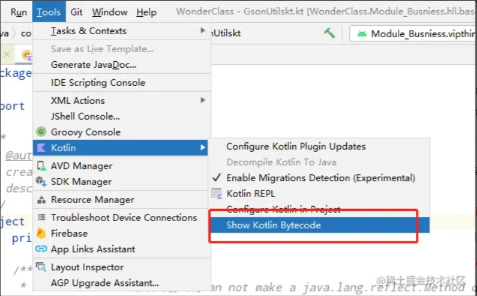
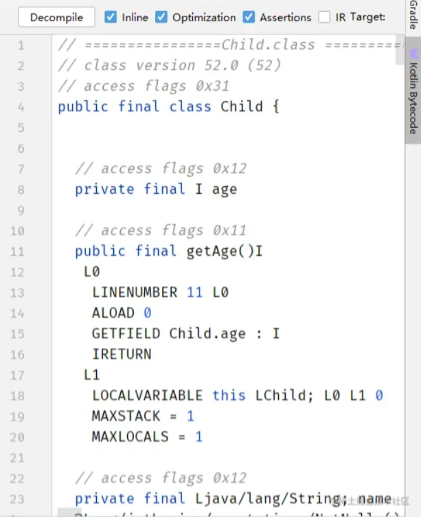

# data class使用详解
## 前言
我们经常创建一些只保存数据的类。 在这些类中，一些标准函数往往是从数据机械推导而来的。在 Kotlin 中，这叫做数据类，并标记为data。定义这些类时，编译器为我们做了什么？自动生成了什么内容？我们可以通过使用，并反编译成java代码进行分析。
## 工具
Android Studio或Intellij都为我们提供了将kt转java的功能，这里介绍下as上边的用法：



Kotlin Bytecode 后，会出现 Kotlin Bytecode 的窗口：



这里可以看到编译后的字节码，点击该界面的右上角：Decompile，即可看到转换后的java代码

## 使用详解

```kotlin
	data class Child(
	    val age: Int,
	    val name: String
	)
```

反编译成java代码后：

    public final class Child {
	   private final int age;
	   @NotNull
	   private final String name;
	
	   public final int getAge() {
	      return this.age;
	   }
	
	   @NotNull
	   public final String getName() {
	      return this.name;
	   }
	
	   public Child(int age, @NotNull String name) {
	      Intrinsics.checkNotNullParameter(name, "name");
	      super();
	      this.age = age;
	      this.name = name;
	   }
	
	   public final int component1() {
	      return this.age;
	   }
	
	   @NotNull
	   public final String component2() {
	      return this.name;
	   }
	
	   @NotNull
	   public final Child copy(int age, @NotNull String name) {
	      Intrinsics.checkNotNullParameter(name, "name");
	      return new Child(age, name);
	   }
	
	   // $FF: synthetic method
	   public static Child copy$default(Child var0, int var1, String var2, int var3, Object var4) {
	      if ((var3 & 1) != 0) {
	         var1 = var0.age;
	      }
	
	      if ((var3 & 2) != 0) {
	         var2 = var0.name;
	      }
	
	      return var0.copy(var1, var2);
	   }
	
	   @NotNull
	   public String toString() {
	      return "Child(age=" + this.age + ", name=" + this.name + ")";
	   }
	
	   public int hashCode() {
	      int var10000 = Integer.hashCode(this.age) * 31;
	      String var10001 = this.name;
	      return var10000 + (var10001 != null ? var10001.hashCode() : 0);
	   }
	
	   public boolean equals(@Nullable Object var1) {
	      if (this != var1) {
	         if (var1 instanceof Child) {
	            Child var2 = (Child)var1;
	            if (this.age == var2.age && Intrinsics.areEqual(this.name, var2.name)) {
	               return true;
	            }
	         }
	
	         return false;
	      } else {
	         return true;
	      }
	   }
	}

可以看到编译器自动帮我们生成了如下东西：

- equals()
- hashCode()
- toString()
- copy()
- componentN()
- 属性的get()/set()
- constructor()

接下来我们将重点放在最后两个方法进行分析

## get()/set()

### 一、set()方法
可以看到上述反编译的java代码，其实是没有包含set()方法的。这是因为我们使用val修饰属性，因此没有提供set进行修改。假如需要，可以改用var修饰
### 二、去除自动生成get()/set()
有时候，我们不需要自动生成某个属性的get、set方法。官方为我们提供了方案，通过在属性上使用注解：@JvmField。例如我们在age上边使用：

	data class Child(
	    @JvmField
	    var age: Int,
	    var name: String
	)

再看源码，可以发现age变成了public，并且没有相应的get、set方法：

	public final class Child {
	   @JvmField
	   public int age;
	   @NotNull
	   private String name;
	
	   @NotNull
	   public final String getName() {
	      return this.name;
	   }
	
	   public final void setName(@NotNull String var1) {
	      Intrinsics.checkNotNullParameter(var1, "<set-?>");
	      this.name = var1;
	   }

### 三、更换自动生成的get、set方法名
有时候我们希望kotlin生成自定义的get、set方法名，可以通过使用@JvmName注解来处理：

	data class Child(
	    @get:JvmName("studentAge")
	    var age: Int,
	    @set:JvmName("studentName")
	    var name: String
	)

上述代码，我们重新指定了age的get()方法和name的set()方法，看下反编译的java代码：

	public final class Child {
	   private int age;
	   @NotNull
	   private String name;
	
	   @JvmName(
	      name = "studentAge"
	   )
	   public final int studentAge() {
	      return this.age;
	   }
	
	   public final void setAge(int var1) {
	      this.age = var1;
	   }
	
	   @NotNull
	   public final String getName() {
	      return this.name;
	   }
	
	   @JvmName(
	      name = "studentName"
	   )
	   public final void studentName(@NotNull String var1) {
	      Intrinsics.checkNotNullParameter(var1, "<set-?>");
	      this.name = var1;
	   }
	}

## constructor()
通常情况下，data class在编译后，会自动生成包含所有属性的构造方法。kotlin是支持参数设置默认值的。怎么让kotlin自动生成多个构造函数的重载呢？这里，可以使用kotlin提供的注解：@JvmOverloads，我们稍微修改下代码：

	data class Child @JvmOverloads constructor(
	    var age: Int,
	    var name: String = ""
	)

重新看下反编译的java代码，发现自动帮我们生成了两个constructor：

	@JvmOverloads
	public Child(int age, @NotNull String name) {
	  Intrinsics.checkNotNullParameter(name, "name");
	  super();
	  this.age = age;
	  this.name = name;
	}
	
	@JvmOverloads
	public Child(int age) {
	  this(age, (String)null, 2, (DefaultConstructorMarker)null);
	}
	
	// $FF: synthetic method
	public Child(int var1, String var2, int var3, DefaultConstructorMarker var4) {
	  if ((var3 & 2) != 0) {
	     var2 = "";
	  }
	
	  this(var1, var2);
	}

这在平时自定义view的时候就比较有用，假如是java代码，我们需要这样实现：

	public class DemoView extends View {
	    public TestView(Context context) {
	        this(context,null);
	    }
	
	    public DemoView(Context context, @Nullable AttributeSet attrs) {
	        this(context, attrs,0);
	    }
	
	    public DemoView(Context context, @Nullable AttributeSet attrs, int defStyleAttr) {
	        this(context, attrs, defStyleAttr,0);
	    }
	
	    public DemoView(Context context, @Nullable AttributeSet attrs, int defStyleAttr, int defStyleRes) {
	        super(context, attrs, defStyleAttr, defStyleRes);
	    }
	}

而使用了@JvmOverloads注解则比较简单：

	class DemoView @JvmOverloads constructor(context: Context, attrs: AttributeSet? = null, defStyleAttr: Int = 0, defStyleRes: Int = 0) : View(context, attrs, defStyleAttr, defStyleRes) {
	}

## componentN()
可以看到，编译器自动生成了n个component开头的方法，每个方法对应返回一个属性值。这有什么用途呢？其实，在kotlin里边，有一个专有的名词：destructuring declarations（解构声明）。那可以用来干什么？看代码：

	data class Child(
	    val age: Int,
	    val name: String,
	    val nickName: String
	)
	
	fun main() {
	    val child = Child(30, "张三丰", "小张")
	    val(studentAge, studentName) = child
	    println(studentAge)
	    println(studentName)
	}

当我们运行main时，发现正常的打印了30和张三丰。这就说明这里已经将child里边的属性值age和name分别赋值给了studentAge和studentName。那它是怎么拿到的呢，看反编译的java源码：

	public final class ChildKt {
	   public static final void main() {
	      Child child = new Child(30, "张三丰", "小张");
	      int studentAge = child.component1();
	      String studentName = child.component2();
	      System.out.println(studentAge);
	      System.out.println(studentName);
	   }
	
	   // $FF: synthetic method
	   public static void main(String[] var0) {
	      main();
	   }
	}

可以发现，就是通过以component开头的方法获取的。那假如我不需要第二个值，而是需要第三个属性值呢？可以通过占位符：_：

	fun main() {
	    val child = Child(30, "张三丰", "小张")
	    val(studentAge, _, studentNickName) = child
	    println(studentAge)
	    println(studentNickName)
	}
